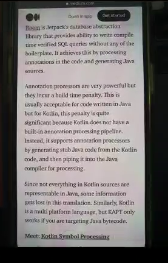
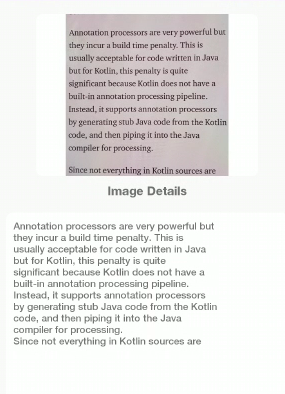

<!-- Project Title -->
<h1>Kotlin Optical Character Recognition (OCR)</h1>

<!-- Project Description -->

This is an Android application that recognizes text from an image.

<!-- Technologies Used -->
<h2>Technologies Used</h2>
<ul>
  <li>Kotlin</li>
  <li>Machine Learning</li>
  <li>Android Studio</li>
</ul>

<!-- Screenshots/GIFs -->
<h2>Screenshots/GIFs</h2>
<!-- Add your images here -->

<!-- Video Demo -->
<h2>Video Demo</h2>

Check out this video demo of the app:

<a href="OCR-Live-Demo">Video</a>

<!-- Installation Instructions -->
<h2>Installation Instructions</h2>
<ol>
  <li>Clone the repository</li>
  <li>Open the project in Android Studio</li>
  <li>Run the app on an emulator or a physical device</li>
</ol>

<!-- How to Use -->
<h2>How to Use</h2>
<ul>
  <li>Open the app</li>
  <li>Choose to take a picture or select an image from the gallery</li>
  <li>The app will recognize the text in the image and copy it to the clipboard</li>
</ul>

<!-- Contributions -->
<h2>Contributions</h2>

Contributions are always welcome! If you'd like to contribute to this project, please fork the repository and create a pull request.

